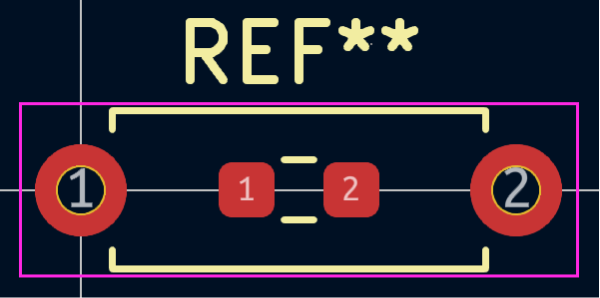
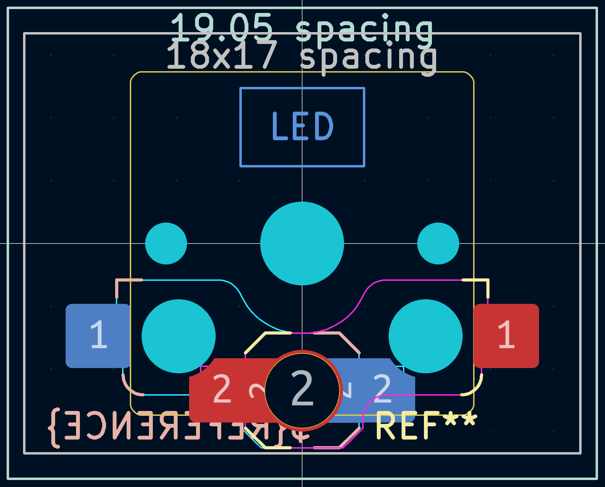

# BGKiCad

My set of KiCad symbols and footprints.

## Footprints

The library provides the following footprints:

#### D_SOD-123

A happy medium between KiCad’s footprints `D_SOD-323` (pads are too small) and
`D_SOD-323_HandSoldering` (pads are too big).

Pad count: 2

#### R_Combined_Axial_DIN0207_0603_1608Metric

A combination of KiCad’s `R_Axial_DIN0207_L6.3mm_D2.5mm_P7.62mm_Horizontal` and
`R_0603_1608Metric_Pad0.98x0.95mm_HandSolder` in a single through-hole *or* surface-mount
footprint.

Pad count: 2

#### SW_Choc_v1_HS_CPG135001S30_1u_Reversible, …1.25u_Reversible, …1.5u_Reversible

Reversible hotswap footprints for Kailh Choc style switches (adapted from [Marbastlib]),
with 1U, 1¼U and 1½U margins.

Pad count: 2

[Marbastlib]: https://github.com/ebastler/marbastlib
