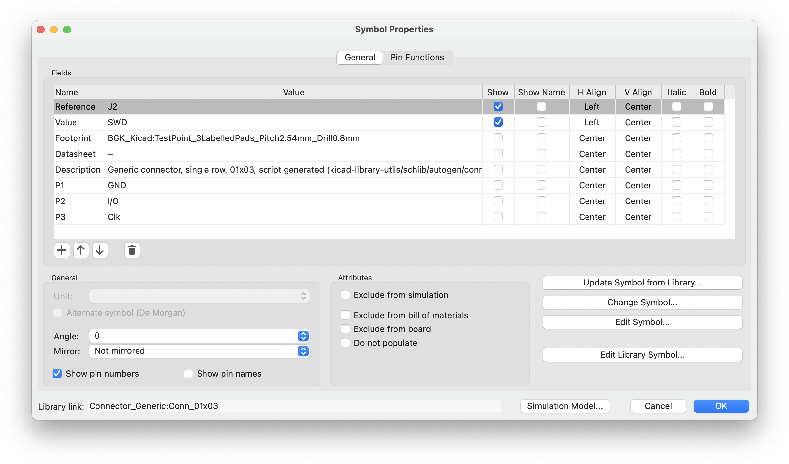
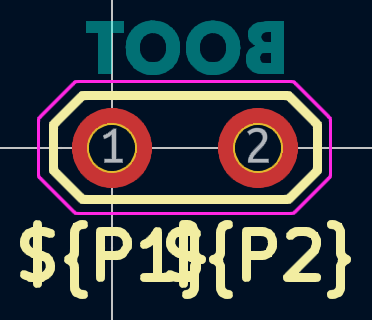
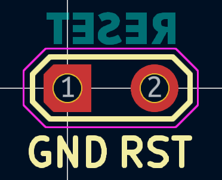
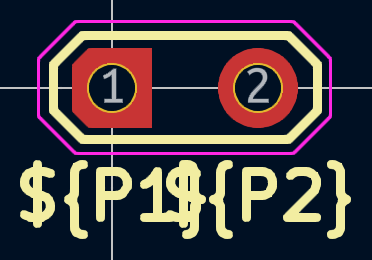
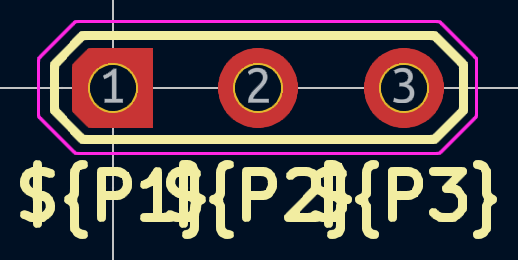

# BGKiCad

My set of KiCad symbols and footprints.

## Footprints

The library provides the following footprints:

#### D_SOD-323

A happy medium between KiCad’s footprints `D_SOD-323` (pads are too small) and
`D_SOD-323_HandSoldering` (pads are too big).

Pad count: 2

#### R_Combined_Axial_DIN0207_0603_1608Metric

A combination of KiCad’s `R_Axial_DIN0207_L6.3mm_D2.5mm_P7.62mm_Horizontal` and
`R_0603_1608Metric_Pad0.98x0.95mm_HandSolder` in a single through-hole *or* surface-mount
footprint.

Pad count: 2

#### SW_Choc_v1_HS_CPG135001S30_1u_Reversible, …1.25u_Reversible, …1.5u_Reversible

Reversible hotswap footprints for Kailh Choc style switches (adapted from [Marbastlib]),
with 1U, 1¼U and 1½U margins.

Pad count: 2

### Reset, Boot, etc. Test Points

The following are adaptions of KiCad’s `TestPoint_2Pads_Pitch2.54mm_Drill0.8mm` footprints
to provide test points labelled pads with specific or generic uses.

Most of these have pins that are labelled on the PCB by adding the P1, P2, etc. to the
symbol in the schematic. For example:

#### BootJumper_Pitch2.54mm_Drill0.8mm

Test point with “BOOT” label in copper (i.e., by removing solder mask) on the back and
pins labelled via the symbol properties P1 and P2 on the front silkscreen.

Pad count: 2

#### BootJumper_Alt_Pitch2.54mm_Drill0.8mm

Test point with “BOOT” label in copper (i.e., by removing solder mask) on the back, with
the two ‘O’ made using the pads themselves and pins labelled via the symbol properties P1
and P2 on the front silkscreen.

Pad count: 2

#### ResetJumper_Pitch2.54mm_Drill0.8mm

Test point with “RESET” label in copper (i.e., by removing solder mask) on the back and
pins labelled GND and RST on the front silkscreen.

Pad count: 2

#### TestPoint_2LabelledPads_Pitch2.54mm_Drill0.8mm

Two-pad test point with pins labelled via the symbol properties P1 and P2 on the
front silkscreen.

Pad count: 2

#### TestPoint_3LabelledPads_Pitch2.54mm_Drill0.8mm

Three-pad test point with pins labelled via the symbol properties P1, P2 and P3 on the
front silkscreen.

Pad count: 3

[Marbastlib]: https://github.com/ebastler/marbastlib
